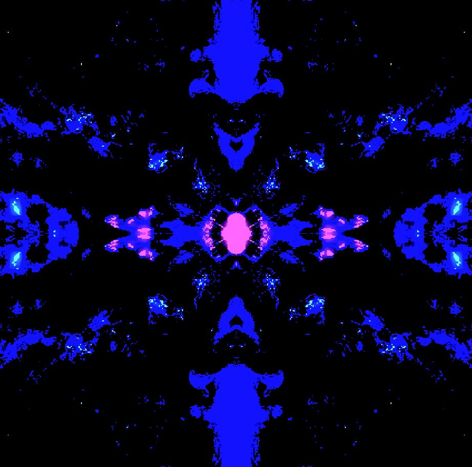
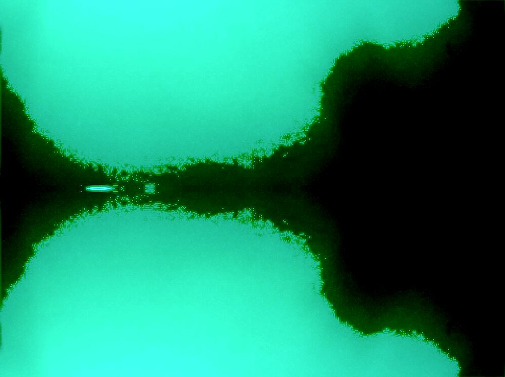
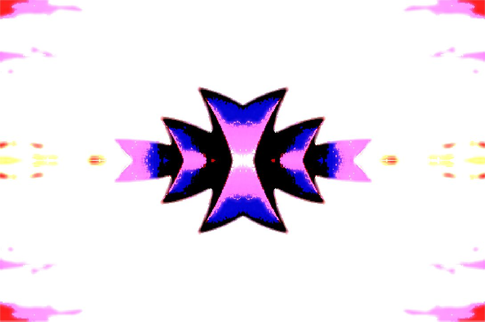
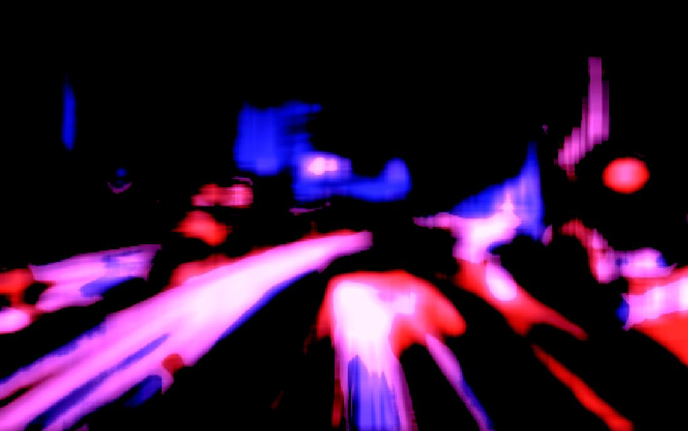
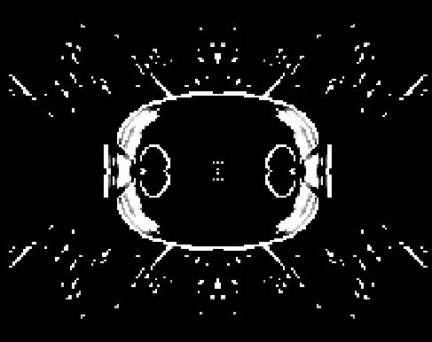
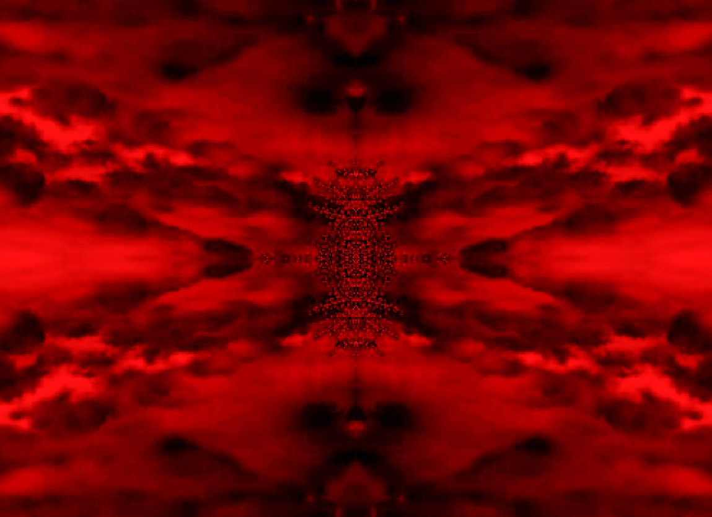
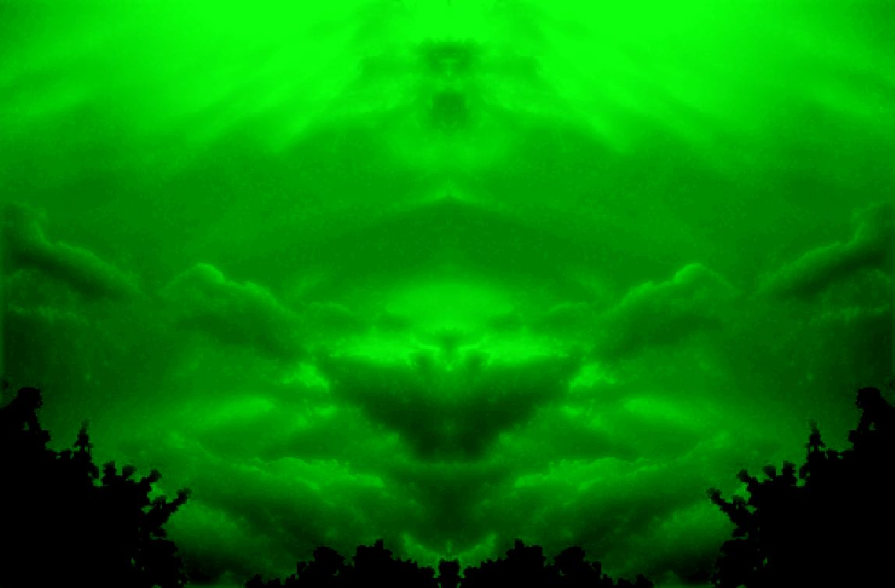

## PFJ Image Editor
PFJ Image Editor is an image editing program that can be used to analyze images and apply a number of different filters and effects!

**To run PFJ Image Editor, you need to have installed Java 17 or later!! You can download the latest here: https://www.oracle.com/java/technologies/downloads/**

## Showcase

## Quick Start Guide
- Download and unzip zip file.
- Double click on PFJ_Image_Editor.exe file to run the program. (Windows may show unrecognized app popup but just click run anyway.)

## Controls
- Left/right arrow keys: next/previous image.
- R: reset effects.
- Click the checkboxes on the right to enable different effects.
- Use the sliders to change the intensity of the applied effects.
- Shift + click pixel: select a pixel (its color will be shown on the right.)

## Color Graph
- The color graph is a graph in the top right that shows the distribution of intensities of red, green, and blue colors of an image.
- The x-axis is the intensity of red, green, or blue ranging from 1 to 255.
- The y-axis is the number of pixels that have that given intensity.
- The range of the y-axis can be changed with the slider below the graph.
- When the color graph is gray, all channels are overlapping\equal.

## Color Box
- The color box is a square in the top right that shows the color of the pixel the mouse is currently hovering over.
- Shift + click on a pixel to select the pixel and lock in the color box's value until another mouse click.

## Presets
- Presets are configurations of filters and effects I though looked cool so I saved them.
- Presets can be loaded by clicking the preset buttons in the bottom right.

## Import/Export
- To add any additional images you'd like to mess around with, add an image file to the data\\images directory, then type its directory in data\\imgDirs.txt.
- Exporting images is currently not possible, sorry.

(This program was made using the Processing Java IDE, more info here: https://processing.org/)

*Please contact for questions or feedback: [maxcontact5@keemail.me](mailto:maxcontact5@keemail.me)*

https://github.com/Max-7777
